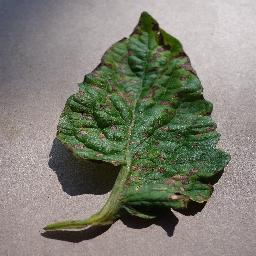

# AgriTech - Team Saraswati 🌾

## 📹 Project Demo Video

Watch our project overview and demo:

[](AgriTech%20--%20Team%20Saraswati.mp4)

If the video does not play in the browser, download and play it locally:
[AgriTech -- Team Saraswati.mp4](AgriTech%20--%20Team%20Saraswati.mp4)

## Vision
Revolutionizing agriculture through innovative technology solutions, making farming more sustainable, efficient, and profitable for farmers worldwide.

## Features
- Smart Crop Management System
- Weather Prediction Integration
- Soil Health Analysis
- Resource Optimization Tools
- Market Price Prediction
- Community Support Platform

## Technology Stack
### Frontend
- TypeScript
- Next.js
- Material-UI
- React Query

### Backend
- Node.js
- Express
- PostgreSQL
- Redis for caching

### ML/AI Components
- Python
- TensorFlow
- Scikit-learn
- Weather API Integration

## Getting Started
```bash
# Clone the repository
git clone https://github.com/Karthikkkk123/AgriTech---Team-Saraswati.git

# Install dependencies
npm install

# Set up environment variables
cp .env.example .env

# Run development server
npm run dev
```

## Key Features Implementation
1. **Crop Management**
   - AI-powered crop selection
   - Growth tracking
   - Yield prediction

2. **Weather Integration**
   - Real-time weather updates
   - Natural disaster alerts
   - Seasonal forecasting

3. **Market Analysis**
   - Price prediction
   - Demand forecasting
   - Market trends

## Project Structure
```
src/
├── components/      # Reusable UI components
├── pages/          # Next.js pages
├── services/       # API services
├── models/         # Data models
├── utils/          # Utility functions
├── styles/         # Global styles
└── config/         # Configuration files
```

## Contributing
We welcome contributions! Please see our contributing guidelines for more details.

## License
This project is licensed under the MIT License - see the LICENSE file for details.

## Team
- Project Lead: Karthik
- UI/UX Design Team
- Backend Development Team
- ML/AI Research Team

## Acknowledgments
- Agricultural Research Partners
- Weather Data Providers
- Farming Community Members
